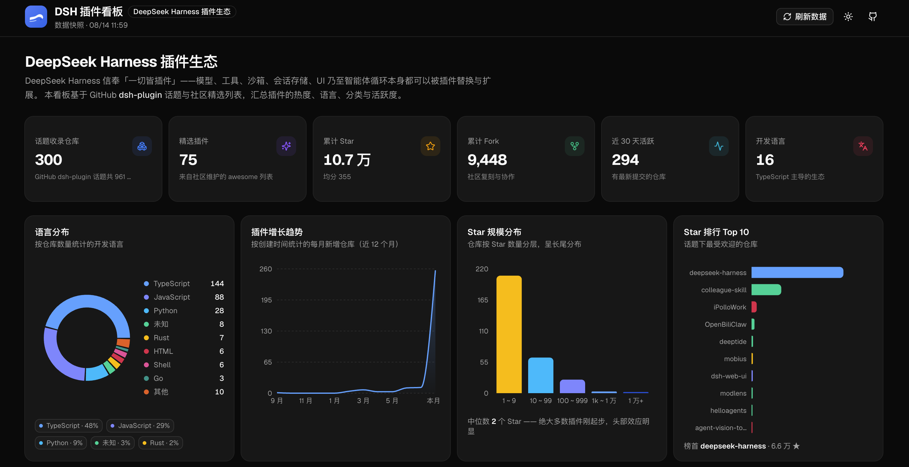
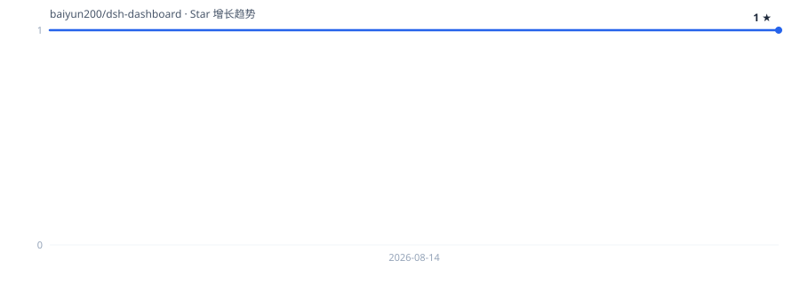

# DSH 插件看板（DeepSeek Harness Plugin Dashboard）

基于 GitHub [`dsh-plugin`](https://github.com/topics/dsh-plugin) 话题的 **DeepSeek Harness 插件生态可视化看板**。
使用 **shadcn/ui** + **Recharts** 构建，全中文界面：统计卡片、图表、分类总览、可搜索/筛选/排序的插件表格与详情抽屉。

> DeepSeek Harness：Everything is a Plugin。模型、工具、沙箱、会话存储、UI 乃至智能体循环都可以用插件替换与扩展。

## 首页预览



## Star 增长趋势



> 由 GitHub Actions 每日自动更新（使用 GITHUB_TOKEN 拉取官方 Stargazer 时间线生成）。

## 在线访问

- **GitHub Pages**：<https://baiyun200.github.io/dsh-dashboard/>　[](https://baiyun200.github.io/dsh-dashboard/)
- 由 GitHub Actions 每日自动构建部署：每天 01:30 UTC（北京时间 09:30）重新抓取 `dsh-plugin` 话题数据并发布；推送 `main` 或手动触发（Actions → 每日构建 & 部署 GitHub Pages → Run workflow）也会重新部署。

## 功能

- 👁️ **访问量展示**：页面右上角实时显示 GitHub Pages 累计访问量（第三方计数服务）

- 📊 **统计卡片**：收录仓库数、精选插件数、累计 Star/Fork、近 30 天活跃、开发语言
- 📈 **图表区**：
  - 语言分布环形图
  - 插件增长趋势（近 12 个月新增）
  - Star 规模分布（长尾生态直方图）
  - Star 排行 Top 10
- 🗂️ **分类总览**：参考 awesome-dsh-plugin / awesome-deepseek-harness 的 11 个中文分类，点击即筛选
- 🔍 **插件列表**：搜索（名称/作者/描述/主题标签）、分类/语言筛选、排序、精选过滤、分页
- 📋 **详情抽屉**：描述、统计、主题标签、时间线、安装命令一键复制
- 🔄 **实时刷新**：一键从 GitHub API 重新拉取话题数据（Top 300），失败优雅降级
- 🌓 **明暗主题**：默认深色，可切换并记忆

## 快速开始

```bash
npm install        # 安装依赖
npm run dev        # 开发模式（Vite，默认 http://localhost:5173）
npm run build      # 类型检查 + 生产构建（输出 dist/）
npm run preview    # 预览生产构建（http://localhost:4173）
```

## 数据管道

内置数据快照来自 `scripts/build-data.mjs`，输入为 `data/raw/` 下的 GitHub API 快照与精选列表：

```bash
bash scripts/fetch-data.sh   # 重新抓取 topic_page1-9.json + awesome README（限流保护）
npm run data                 # 归一化 + 中文分类 → src/data/plugins.json
```

看板右上角「刷新数据」按钮可在浏览器内直接调用 GitHub API 更新（会缓存到 localStorage）。

## 质量验证

```bash
npm run preview    # 先启动预览
node scripts/smoke-test.mjs   # puppeteer-core + 本机 Chrome 的 14 项端到端冒烟测试
```

## 目录结构

```
src/
  components/
    charts/        # 环形图 / 增长趋势 / 分布直方图 / 排行
    ui/            # shadcn/ui 组件（base-nova 风格）
    *.tsx          # 头部 / 统计卡片 / 分类总览 / 插件表格 / 详情抽屉 / 页脚
  data/plugins.json   # 构建产物：592 个仓库 + 统计
  lib/             # 类型 / 数据工具 / GitHub 实时刷新 / 主题
scripts/
  build-data.mjs   # 数据构建
  fetch-data.sh    # 数据抓取
  smoke-test.mjs   # 端到端冒烟测试
```

## 免责声明

本看板为社区项目，与 DeepSeek 官方无关联；收录不代表官方背书。安装第三方插件会执行其代码，请自行审阅源码。
